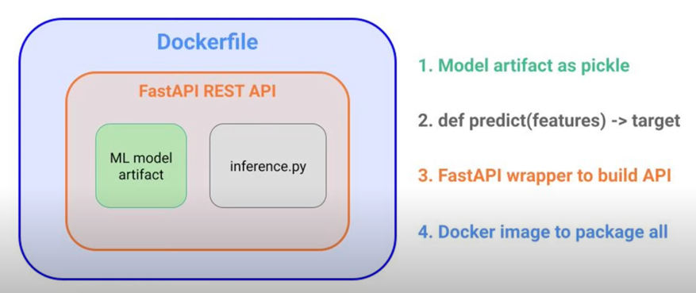

# titanic-machine-learning

This report is summarizing a machine learning project that predicts the survival of passengers on the Titanic.
It uses Iterative Dichotomiser 3 decision tree algorithm.

The dataset is from Kaggle and contains information about the passengers on the Titanic.
https://www.kaggle.com/competitions/titanic/overview

The goal is to predict whether a passenger survived or not based on the features in the dataset.

## Algorithm

The [iterative_dichotomiser_3.ipynb](notebooks/iterative_dichotomiser_3.ipynb) Jupyter notebook contains
the implementation of the ID3 algorithm.

It uses a recursive approach to build the tree.

The algorithm is based on the information gain that is calculated using the entropy.

The whole proces consists of:

0) Load the data from csv file [put-titanic-homework.csv](data/put-titanic-homework.csv)
1) Data preprocessing - saving preprocessed data in a datastore
2) Create a DecisionTreeClassifier() object
    - initialize the object using values, column (feature names) and stating the labels (survived = 1, not survived = 0)
2) Train the model (create the tree) by initializing the object and calling the id3() method (commonly called fit() in
   sklearn)
3) The model will calculate the:
    - entropy for the whole dataset
    - take all passengers and calculate the entropy for each feature
    - calculate the information gain for each feature
    - choose the feature that maximizes the information gain
    - add the best information gain feature as a node in the tree
    - for each possible choice in this feature:
        * calculate remaining passengers for this (split the dataset based on the choice)
        * calculate the entropy for the new dataset
        * calculate the information gain for the new dataset
        * choose the feature that maximizes the information gain
        * add the best information gain feature as a node in the tree
        * repeat the process until:
            - all passengers survived from subset survived or not -> then add a leaf with 1 or 0 label respectively
            - there are no more features to split on -> then add a leaf with the most common label in the subset

## Results

The algorithm was compared to the baseline results taken from Kaggle websit.

The baseline results are as follows:
Naive Bayes (72.6%)
Logistic Regression (82.1%)
Decision Tree (77.6%)
K Nearest Neighbor (80.5%)
Random Forest (80.6%)
Support Vector Classifier (83.2%)
Xtreme Gradient Boosting (81.8%)
Soft Voting Classifier - All Models (82.8%)

ID3 (...) - not tested yet (#TODO)

It needs to be noted that the results are based on the training dataset from Kaggle website and our ID3 tree was trained
using a slightly simplier dataset using less features.

## Build

To build the container locally use:

```bash
docker buid -t IMAGE_NAME .
```



## TODO:

- [ ] build model artifact as pickle
- [ ] build internference.py - python funciton that preproces input features and passes them to model
- [ ] rest api wrapper fastapi / flask
- [ ] modify the dockerfile
- [ ] create train pipeline - pulls from datastore and creates model and saves it
- [ ] Add testing pipeline - takes the model and tests it
- [ ] Add interference pipeline - somebody inputs data and expects a prediction
